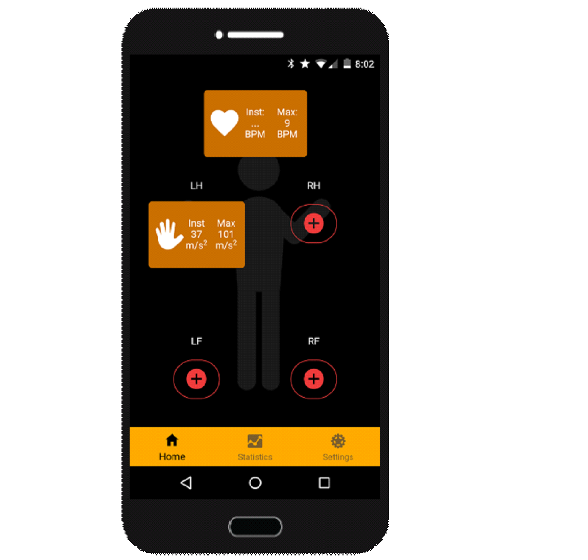

# Combat Monitoring App

This app was developed on Ionic/Cordova using the Ionic [Super Starter Template](https://github.com/ionic-team/ionic-starter-super) as the base. The purpose of the application was to connect to a health tracker that returned HR data and the velocity of limb movements, for combat scenarios. The app provides a Bluetooth service that connect to a Bluetooth transmitter (in this case the BLE-112A) to receive pre-formatted serial data that it then parses and stores.

# Hardware

 1. Pulse Sensor [SEN-11574](https://www.sparkfun.com/products/11574)
 2. Microcontroller [TI-MSP430G2553](https://www.amazon.com/Texas-Instruments-Educational-Products-MSP-EXP430G2/dp/B004G52S82)
 3. Bluetooth [BLE-112A](https://hardwarebreakout.com/product/ble112-breakout-board/)
 4. Accelerometer [BMA-220](https://www.dfrobot.com/product-1085.html)

## What Works?

 1. Bluetooth Service
 2. GUI for Displaying HR
 3. GUI for Displaying Velocity

## In-Progress

 1. Data Storage
 2. Bad Data Parsing - Sync Issues
 3. Statistics
 4. Custom User Profiles
